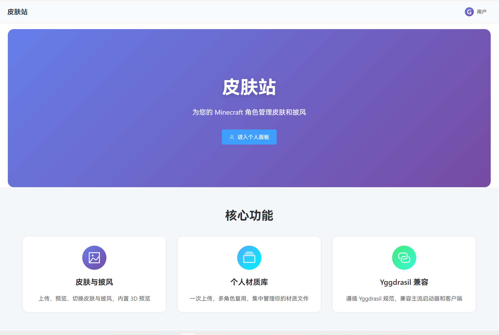

# Element-Skin — Minecraft Yggdrasil 皮肤站

[](https://deepwiki.com/water2004/element-skin)

基于 Vue 3 + FastAPI 的现代化 Minecraft 外置登录系统。提供极佳的 UI 体验，完整支持 Yggdrasil 协议，兼容所有主流启动器。



## ✨ 功能特性

- **✅ 完整协议支持**: 完美实现 Yggdrasil API，无缝对接 Authlib-Injector 等主流加载器。
- **✅ 皮肤管理**: 支持皮肤/披风上传，集成 SkinView3D 提供丝滑的 3D 实时预览。
- **✅ 完善的用户系统**: 包含邮箱验证、注册验证码、密码找回流程（支持 SMTP）。
- **✅ 强大的管理后台**: 响应式设计，支持用户管理、邀请码机制、轮播图配置及邮件服务测试。
- **✅ 安全与防护**: 内置 API 速率限制 (Rate Limiting) 及多种安全防护机制。
- **✅ 灵活部署**: 既支持 Docker 一键部署，也支持复杂的子目录 (Sub-path) 架构。

---

## 🚀 Docker 部署指南 (推荐)

我们提供了三种部署方案，**强烈建议使用方案 A（默认方案）**，直接使用预构建镜像，无需本地编译。

### 1. 准备配置文件

在宿主机创建 `config.yaml` 文件。这是系统运行的核心配置。

<details>
<summary><b>📄 点击展开查看 config.yaml 模板（必须配置）</b></summary>

```yaml
# Element-Skin 配置文件

jwt:
  secret: "CHANGE-ME-TO-RANDOM-SECRET"  # ⚠️ 生产环境必须修改为随机字符串

# RSA 密钥配置 (系统会自动生成，指定路径即可)
keys:
  private_key: "/data/private.pem"
  public_key: "/data/public.pem"

database:
  path: "/data/yggdrasil.db"

textures:
  directory: "/data/textures"

carousel:
  directory: "/data/carousel"

server:
  host: "0.0.0.0"
  port: 8000
  # ⚠️ 如果使用方案A (GHCR镜像)，此处必须保留为 /skinapi
  # 如果是本地构建且自定义路径，请根据实际情况修改
  root_path: "/skinapi" 
  # ⚠️ 站点的外部访问地址 (用于 OAuth 回调及 Yggdrasil 发现服务)
  site_url: "http://yourdomain.com" 

# CORS 跨域配置
cors:
  # 生产环境建议配置具体域名，如 ["https://yourdomain.com"]
  allow_origins: ["*"]
  allow_credentials: true

mojang:
  session_url: "https://sessionserver.mojang.com"
  account_url: "https://api.mojang.com"
  services_url: "https://api.minecraftservices.com"
  skin_domains:
    - "textures.minecraft.net"
  cache_ttl: 3600
```
</details>

### 2. 选择部署方案

请根据你的需求选择一种方案，配置 `docker-compose.yml` 和 `Nginx`。

#### 方案 A：根目录部署 (GHCR 镜像) —— ✅ 推荐
*无需本地构建，开箱即用。*

**docker-compose.yml**
```yaml
version: '3.8'
services:
  backend:
    image: ghcr.io/water2004/element-skin-backend:main
    container_name: element-skin-backend
    restart: unless-stopped
    ports:
      - "8000:8000"
    volumes:
      - ./config.yaml:/app/config.yaml:ro
      - ./data:/data
  frontend:
    image: ghcr.io/water2004/element-skin-frontend:main
    container_name: element-skin-frontend
    restart: unless-stopped
    ports:
      - "3000:3000"
```

在项目的根目录下, 有一份完整的`docker-compose.yml`配置模板, 但若是使用ghcr镜像, 上面的配置已经足够

**Nginx 主机配置**
```nginx
server {
    listen 80;
    server_name yourdomain.com;

    location / {
        proxy_pass http://localhost:3000/; # 注意末尾的 /
    }

    # 后端 API 转发
    # 注意：使用 GHCR 镜像时，后端必须匹配 /skinapi 路径
    location /skinapi/ {
        proxy_pass http://localhost:8000; # 注意末尾没有 /
        proxy_set_header Host $host;
        proxy_set_header X-Real-IP $remote_addr;
    }
    
    # 处理不带斜杠的请求
    location = /skinapi {
        proxy_pass http://localhost:8000;
        proxy_set_header Host $host;
        proxy_set_header X-Real-IP $remote_addr;
    }
}
```

---

#### 方案 B：子目录部署 (本地构建)
*适用于将皮肤站部署在 `https://example.com/skin/` 这样的子路径下。此方案需要本地编译前端。*

**启动命令**
根据你的路径需求，修改项目根目录下的`docker-compose.yml`, 并使用对应的环境变量启动：

| 场景 | 前端路径 | 后端路径 | 启动命令 |
|-----|---------|---------|---------|
| **场景 1** | `/skin/` | `/skinapi` | `VITE_BASE_PATH=/skin/ docker compose up -d --build` |
| **场景 2** | `/skin/` | `/skin/api/` | `VITE_BASE_PATH=/skin/ VITE_API_BASE=/skin/api docker compose up -d --build` |

> 💡 **低内存模式**: 如果构建时内存不足，可添加 `BUILD_MODE=low-memory` 环境变量跳过类型检查。

**Nginx 主机配置 (对应场景 1)**
```nginx
location /skin/ {
    proxy_pass http://localhost:3000/; # 末尾有 /，去除 /skin/ 前缀
}
location /skinapi/ {
    proxy_pass http://localhost:8000;  # 末尾无 /，保留完整路径
    proxy_set_header Host $host;
}
```

**Nginx 主机配置 (对应场景 2)**
```nginx
location /skin/ {
    proxy_pass http://localhost:3000/;
}
location /skin/api/ {
    proxy_pass http://localhost:8000;
    proxy_set_header Host $host;
}
```

---

### 3. 初始化设置 (重要)

容器启动成功后，请按以下步骤完成初始化：

1.  **注册管理员**: 访问你的站点，注册的**第一个账号**将自动获得管理员权限。
2.  **配置后端 API**:
    *   登录后进入 `管理面板` -> `站点设置`。
    *   修改 **后端 API 地址**。
    *   ⚠️ **注意**: 此处必须填写浏览器可访问的完整 URL（例如 `https://yourdomain.com/skinapi` 或 `https://yourdomain.com/skin/api`）。如果配置错误，材质预览将无法加载。
    
    

3.  **配置邮件服务**:
    *   进入 `管理面板` -> `邮件服务`。
    *   配置 SMTP 信息并开启“邮件验证开关”，即可启用验证码和密码找回功能。

---

## 🛠️ 本地开发环境

如果你需要修改代码或参与贡献：

### 后端 (Python)
```bash
cd skin-backend
python -m venv .venv
# Windows:
.venv\Scripts\activate
# Linux/macOS:
source .venv/bin/activate

pip install -r requirements.txt
python gen_key.py                # 生成 RSA 密钥
uvicorn routes_reference:app --reload
```

### 前端 (Node.js)
```bash
cd element-skin
npm install
npm run dev
```
访问 http://localhost:5173

---

## 📂 项目结构

```text
element-skin/
├── element-skin/       # 前端源码 (Vue 3 + Element Plus)
├── skin-backend/       # 后端源码 (FastAPI)
├── config.yaml         # 配置文件 (需手动创建)
├── data/               # 数据存储 (数据库、材质、密钥，自动生成)
├── docker-compose.yml  # Docker 编排文件
└── nginx-host.conf     # Nginx 配置参考
```

## 📋 TODO 

### 核心功能
- [x] 完整的yggdrasil协议支持
- [x] 用户注册与登录
- [x] 用户材质上传
- [x] 游戏角色管理
- [x] 邮箱验证码与密码找回
- [x] 邀请码注册机制
- [x] Mojang服务fallback机制
- [x] 用户封禁与解封
- [x] 公共皮肤库
- [ ] 更好的用户材质管理
  - [x] 允许用户删除自己上传到公共库的材质
  - [x] 允许用户配置已有的材质信息, 如模型类型等
  - [x] 公共皮肤库添加材质名称
  - [ ] 公共皮肤库按名称搜索
  - [ ] 公共皮肤库按上传时间排序,热度排序
- [ ] 多个fallback服务支持

### 安全与性能
- [x] sqlite数据库模块
- [x] JWT认证机制
- [x] API速率限制
- [x] 数据库内存缓存与连接池
- [ ] 管理员设置细粒度API
- [ ] 数据库性能优化
- [ ] 多数据库支持（PostgreSQL、MySQL等）
- [ ] Redis缓存支持
- [ ] 材质存储优化（如使用云存储或CDN）

### 前端优化
- [x] 响应式设计
- [x] 深色模式支持
- [ ] 页脚信息（如站点名称、版权信息等）
- [ ] 国际化 (i18n) 支持
- [ ] 移动端适配优化
- [ ] 前端性能优化（如图片懒加载、代码分割等）

### 端点与集成
- [ ] 移动端 App 认证接口
- [ ] 第三方登录（GitHub、微博等）
- [ ] 批量材质导入工具

### 测试
- [ ] 测试框架
- [ ] 单元测试覆盖核心功能
- [ ] 集成测试覆盖主要用户流程

## 📄 许可证

[MIT License](LICENSE)