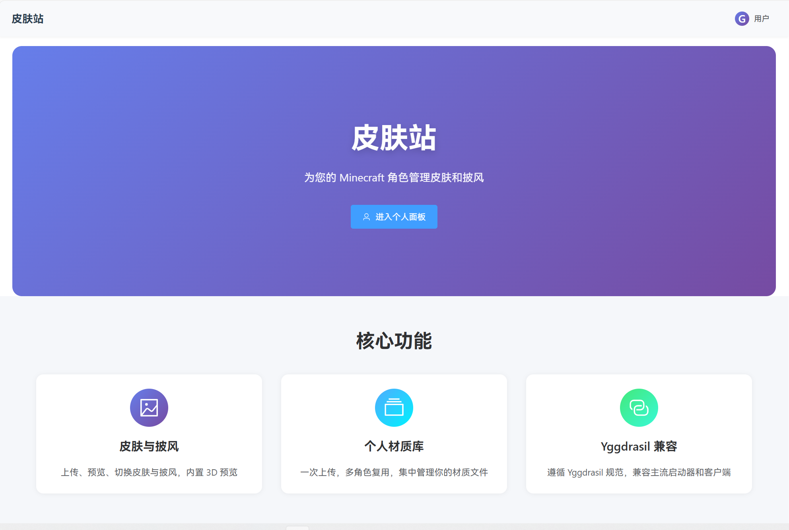

<p align="center">
  
</p>

<p align="center">
  面向高并发场景的现代化外置登录与材质平台
</p>

<p align="center">
  <a href="https://deepwiki.com/water2004/element-skin">
    
  </a>
  <a href="LICENSE">
    
  </a>
  
  
  
  
</p>



## ✨ 功能特性

- **现代化架构**：Go 1.26 后端，使用 PostgreSQL 18 保存结构化业务数据，使用 Redis 处理缓存、限流和短期状态。
- **Yggdrasil 兼容**：支持 Authlib-Injector、启动器和 Minecraft 服务器所需的认证、会话、角色查询、材质签名与服务器加入接口。
- **Fallback 服务**：支持多个外部皮肤站作为 fallback，提供健康检查、角色与材质导入、公钥发现和缓存。
- **用户与资源管理**：支持邮箱验证、密码找回、角色管理、皮肤与披风上传、衣柜、3D 预览和公共皮肤库。
- **外部身份与角色同步**：支持多 OIDC 身份、第三方登录、Microsoft 正版角色绑定与显式同步，以及远程 Yggdrasil 角色导入。
- **细粒度权限**：支持多角色、单项权限覆盖、权限范围、受保护权限主体和按权限展示页面与操作。
- **OAuth/OIDC 第三方应用**：支持标准 OpenID Connect Provider、公开与机密 OAuth 应用、Authorization Code + PKCE、Device Code、Client Credentials、Refresh Token、撤销、权限审核和按权限订阅的异步 Webhook。
- **注册策略**：支持邮箱验证码、邮箱后缀白名单或黑名单、邀请码以及对应的公开注册引导。
- **通知中心**：统一展示公告、系统消息和 OAuth 事件，支持 Markdown 长公告、短公告、定向投递、未读提醒和过期清理。
- **Minecraft 能力 API**：通过 `/v2/minecraft` 提供公开角色查询、材质属性读取和服务器加入结果校验，不替代 Yggdrasil 协议。
- **首页与仪表盘**：支持普通背景图、Minecraft 全景背景、首页媒体管理、服务状态监测、公告侧栏和节日彩蛋。
- **现代化前端**：Vue 3、Element Plus、Tailwind CSS，支持响应式布局、深色模式、按权限显示导航和移动端访问。
- **浏览器缓存**：统一封装 localStorage 与 IndexedDB，支持材质文件、角色卡片和材质卡片渲染结果的 LRU 缓存与大小限制。
- **Python SDK**：提供 OAuth 流程、权限模型、token 管理、`/v2` API 调用和 Webhook 验签/解析封装，并附带开发示例与中文文档。
- **安全与部署**：提供 API 限流、CORS、出站请求校验、结构化错误处理和单一 Docker Compose 部署方式。

---

## 🚀 Docker 部署指南 (推荐)

项目现在默认使用 **PostgreSQL 18 + Redis** 并支持自动化初始化。PostgreSQL 保存用户、设置、材质元数据等持久化数据；Redis 负责公开配置/首页媒体缓存、邮件验证码、限流数据和短期用户鉴权缓存等临时状态。

### 1. 准备 `.env`

Docker 部署只使用仓库根目录的 `docker-compose.yml`。复制 `.env.example` 为 `.env`，然后只修改 `.env`：

```bash
cp .env.example .env
```

必须重点修改这些值：

- `ELEMENT_SKIN_IMAGE`：后端镜像，默认 `ghcr.io/water2004/element-skin:latest`
- `JWT_SECRET`：生产环境随机长密钥
- `IDENTITY_ENCRYPTION_KEY`：使用 `openssl rand -base64 32` 生成一次并长期保存
- `DATABASE_PASSWORD` / `REDIS_PASSWORD`：数据库和 Redis 密码
- `SERVER_SITE_URL`：站点外部访问地址
- `SERVER_API_URL`：后端 API 外部访问地址
- `CORS_ALLOW_ORIGINS`：允许访问 API 的前端来源

后端启动时会读取环境变量，并从 `DATABASE_HOST/PORT/USER/PASSWORD/NAME/SSLMODE` 和 `REDIS_HOST/PORT` 派生连接地址。Docker 部署不需要挂载 `config.yaml`，也不维护第二份 Compose 配置。

**v4.0.0 的部署方式已经改变。** 相比 v3，官方 Compose 新增了独立的 `webhook-worker` 服务，旧版
`docker-compose.yml` 不能原样继续使用。Compose 会从同一镜像启动 `backend` 和 `webhook-worker`；
worker 不暴露端口。自建部署只有在启用 Webhook 时才需要运行镜像内的 `/app/webhook-worker`；未使用
Webhook 的站点可以只运行主后端。已经配置 Webhook 订阅但没有运行 Worker 时，主站其他功能仍可用，
但事件只会积压在数据库中，不会投递或清理。

首次启动时如果 Yggdrasil 的 `/app/data/private.pem`、`/app/data/public.pem` 或 OIDC 的
`/app/data/oidc-private.pem`、`/app/data/oidc-public.pem` 不存在，系统会自动生成并保存。请持久化
`./data` 目录，其中 `./data/db` 会挂载到 PostgreSQL 容器的 `/var/lib/postgresql`。后续不要删除或
替换这些私钥。`IDENTITY_ENCRYPTION_KEY` 用于加密 OIDC client secret 和外部 refresh token，配置
身份提供方后不得重新生成，否则已有密文将无法解密。

v4.0.0 的自动数据库升级只支持 v3.0.2 → v4.0.0。v2.x、v3.0.0 和 v3.0.1 站点必须先升级到
v3.0.2 并确认能够正常启动，再升级到 v4.0.0。完整变化和升级步骤见 [v4.0.0 Release Notes](RELEASE.md)。

从 v3.0.2 升级时，后端会把已配置的 `microsoft_client_id` 和 `microsoft_client_secret` 一次性迁移为
只开放绑定能力的 Microsoft OIDC provider。只有 provider 创建成功后才删除旧设置；失败时保留旧值
并终止启动。旧版导入的角色和材质保持不变，但旧流程没有持久化 Microsoft 用户 refresh token，
因此用户仍需重新授权一次。升级前还需要在 Azure 应用中加入新的 Web 回调地址：

```text
${SERVER_API_URL}/v2/auth/oidc/callback
```

**Nginx 主机配置**
只需将 Nginx 的 `root` 指向宿主机的 `./frontend` 目录。

```nginx
server {
    listen 80;
    server_name yourdomain.com;

    # 1. 前端根目录 (index.html, assets, 以及皮肤 static/)
    root /your/path/to/frontend; 
    index index.html;

    location / {
        add_header X-Authlib-Injector-API-Location "http://yourdomain.com/skinapi" always;
        try_files $uri $uri/ /index.html;
    }

    # 2. 后端 API 转发
    location /skinapi/ {
        proxy_pass http://localhost:8000/;
        proxy_set_header Host $host;
    }
    
    # 直接转发不带斜杠的 API 请求
    location = /skinapi {
        return 308 /skinapi/;
    }
}
```
### 2. 启动服务

拉取镜像并启动：

```bash
docker compose pull
docker compose up -d
```

对于希望前端或后端地址部署在子目录的用户，可以通过 `.env` 灵活配置路径：
- **前端路径**: 通过 `VITE_BASE_PATH` 定义前端资源的基础路径
- **后端路径**: 通过 `VITE_API_BASE` 定义后端 API 的基础路径

根据你的路径需求修改 `.env`，然后重新执行 `docker compose up -d`。前端会根据这些参数在容器启动时替换路径，并自动释放到宿主机的 `./frontend` 目录：

| 场景 | `VITE_BASE_PATH` | `VITE_API_BASE` |
|-----|---------|---------|
| **场景 1** | `/skin/` | `/skinapi` |
| **场景 2** | `/skin/` | `/skin/api/` |

需要注意的是，`.env` 中的 `SERVER_SITE_URL` 和 `SERVER_API_URL` 也需要根据实际部署路径进行调整，以确保生成的链接正确。
当 `VITE_API_BASE` 使用 `/skinapi`、`/skin/api` 这类前缀时，Nginx 的 `proxy_pass` 末尾必须带 `/`，这样会把前缀剥掉再转发给后端。例如 `/skinapi/v2/users/me` 会转成后端实际路由 `/v2/users/me`。

**Nginx 主机配置 (对应场景 1)**
```nginx
# 1. 前端静态文件
location /skin/ {
    add_header X-Authlib-Injector-API-Location "http://yourdomain.com/skinapi" always;
    alias /your/path/to/frontend/;
    index index.html;
    try_files $uri $uri/ /skin/index.html;
}
location = /skin {
    alias /your/path/to/frontend/;
    try_files $uri $uri/ /skin/index.html;
}

# 2. 后端 API 转发
location /skinapi/ {
    proxy_pass http://localhost:8000/;
    proxy_set_header Host $host;
}
location = /skinapi {
    return 308 /skinapi/;
}
```

**Nginx 主机配置 (对应场景 2)**
```nginx
# 1. 前端静态文件
location /skin/ {
    add_header X-Authlib-Injector-API-Location "http://yourdomain.com/skin/api" always;
    alias /your/path/to/frontend/;
    index index.html;
    try_files $uri $uri/ /skin/index.html;
}
location = /skin {
    alias /your/path/to/frontend/;
    try_files $uri $uri/ /skin/index.html;
}

# 2. 后端 API 转发 (嵌套路径)
location /skin/api/ {
    proxy_pass http://localhost:8000/;
    proxy_set_header Host $host;
}
location = /skin/api {
    return 308 /skin/api/;
}
```
---

## 🛠️ 本地开发环境

### 本地开发环境

#### 1. 数据库配置 (PostgreSQL 18+)
本地开发需要手动安装并初始化数据库：

1.  **安装 PostgreSQL**: 确保本地已安装 PostgreSQL 18（或 16+）。
2.  **创建数据库**: 使用 `psql` 或 GUI 工具（如 pgAdmin/DBeaver）创建用户和数据库：
    ```sql
    -- 建议创建专用用户和库
    CREATE USER elementskin WITH PASSWORD 'password123';
    CREATE DATABASE elementskin OWNER elementskin;
    ```
3.  **修改配置**: 编辑 `skin-backend/config.yaml` 中的数据库字段：
    ```yaml
    database:
      host: "localhost"
      port: "5432"
      user: "elementskin"
      password: "password123"
      name: "elementskin"
      sslmode: "disable"
    ```
    > 💡 **自动初始化**: 后端在每次启动时会自动同步数据库结构（创建缺失的表及默认配置），无需手动执行 SQL 脚本。

#### 2. Redis 配置
本地开发需要 Redis 运行在 `127.0.0.1:6379`。如果你的 Redis 设置了密码，请同步修改 `skin-backend/config.yaml`：

```yaml
redis:
  host: "127.0.0.1"
  port: "6379"
  password: ""
  db: 0
  key_prefix: "elementskin:"
```

#### 3. 后端 (Go 1.26+)
```bash
cd skin-backend
go run ./cmd/element-skin
```

#### 4. 前端 (Node.js)
```bash
cd element-skin
npm install
npm run dev
```

---

## 📂 项目结构

```text
element-skin/
├── element-skin/       # 前端源码 (Vue 3 + Element Plus)
├── skin-backend/       # Go 后端源码
│   ├── cmd/            # 进程入口
│   ├── internal/       # HTTP、服务、数据库与测试模块
│   └── config.yaml     # 后端配置文件
├── .env.example        # Docker 部署环境变量模板
├── data/               # Docker 持久化数据 (自动生成)
├── frontend/           # Docker 释放的前端静态文件 (自动生成)
├── docker-compose.yml  
└── README.md
```

---

## 🧪 自动化测试

Go 后端采用分层测试架构，确保从底层数据库到顶层 API 的稳定性。

### 测试架构
1.  **数据库层 (`internal/database`)**: 验证 SQL 逻辑、数据迁移及缓存一致性。
2.  **业务逻辑层 (`internal/service`)**: 验证核心业务规则（如注册权限、材质级联更新）。
3.  **HTTP 集成层 (`internal/integration`)**: 使用真实 PostgreSQL 和真实 Redis，模拟真实 HTTP 请求。

### 运行测试
测试会自动创建临时数据库和文件目录，不会影响本地开发数据。

```bash
cd skin-backend
go test ./...
```

### 编写新测试
单元测试使用内存 Redis mock；`internal/integration` 使用真实 Redis，并通过唯一 key 前缀自动清理测试数据，不会清空你的本地 Redis。

## 📄 许可证

[MIT License](LICENSE)
